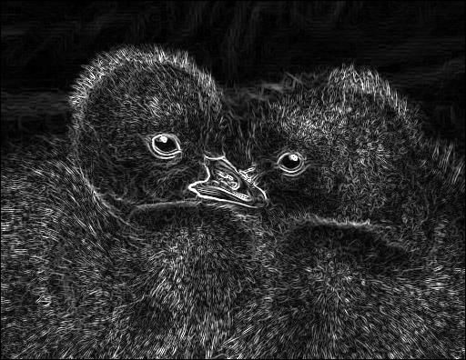
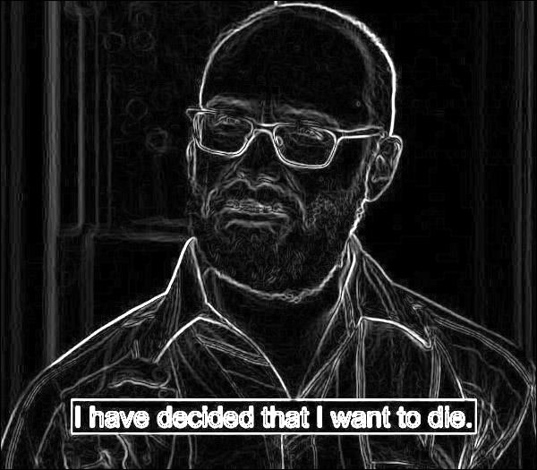

SobelEdgeDetector
====================

My python implementation of Sobel edge detecting
---------------------

Slowly working on developing an array of image analysis programs. Also, Andy asked me to do it :P

## Issue tracking
- [x] Repository setup and README created
- [x] Make problems to fix!
- [x] Find images
- [x] Learn image editing in python
- [x] Write algorithm
- [x] Clean up code, add comments, and upload to github!
- [ ] Code needs optimization! Loops in python are very slow, numpy may be able to fix it
- [ ] Add option for thresholding (Will make Sobel crisper)

## Ducklings no edit

## Ducklings with Sobel edge detection

## VSauce meme no edit

## VSauce meme with Sobel edge detection
